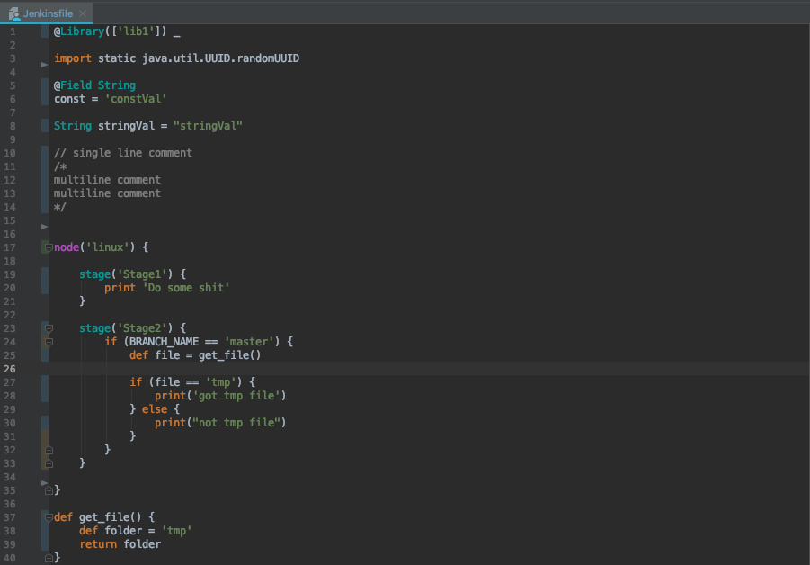

# pycharm-jenkinsfile

### Support for Jenkinsfile syntax highlighting



<br />
Copy Jenkinsfile.xml to your filetypes folder, and restart PyCharm


<br />

#### macOS
```
~/Library/Preferences/PyCharmXX/filetypes
```

#### Linux
```
/.PyCharmXX/config/filetypes
```

#### Windows
```
<User home>\.PyCharmXX\config
```